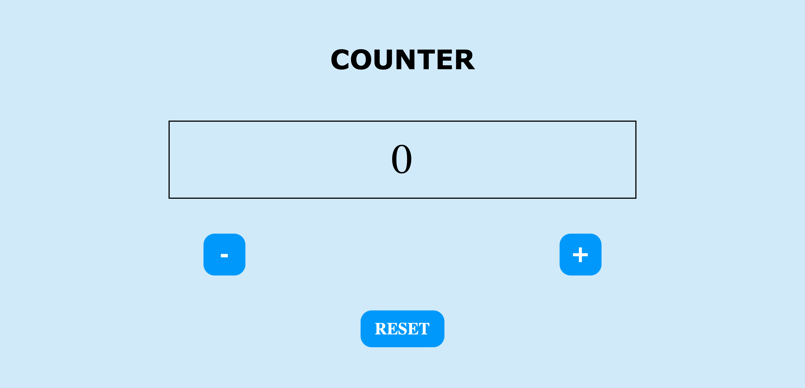

# counterJS

<h3> About the project </h3>

 This is a simple counter developed with JavaScript:

<ul>
  <li> clicking the + button increases the value by one </li>
  <li> clicking the button - decreases the value by one</li>
  <li>clicking the "reset" button resets the counter value </li>
  </ul>
  
  
 
